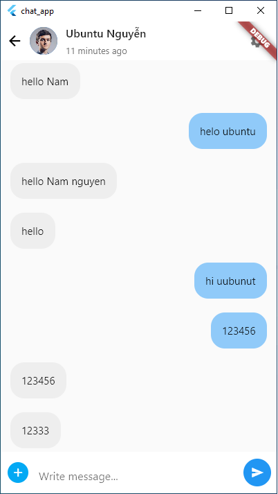

# chat-hybrid
.net core 5 + angular 11 + flutter 3.0
demo: https://youtu.be/sjObxk1rSAU

## Sửa file chat_app\lib\helper\globals.dart
**const serverName = "localhost"; //10.0.2.2 for mobile**
Nếu chạy trên mobile thì là 10.0.2.2
Còn nếu chạy app desktop trên windows là: localhost

## Cấu hình chạy với no-sound-null-safety

## ảnh minh họa

